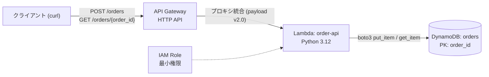

# serverless-order-api-demo

API Gateway (HTTP API) → Lambda (Python 3.12) → DynamoDB の最小構成で作る注文API。
AWS CLI を1リソースずつ叩いて構築する学習用ハンズオン（2026-07-14 実施）。



## 使い方

```bash
./scripts/01_dynamodb.sh   # orders テーブル (PK: order_id, オンデマンド課金)
./scripts/02_iam.sh        # Lambda 実行ロール (Logs + orders テーブル限定 RW)
./scripts/03_lambda.sh     # 関数デプロイ + API を通す前の単体 invoke テスト
./scripts/04_apigw.sh      # HTTP API + ルート2本 + Lambda への invoke 許可
./scripts/05_test.sh       # E2E: 201 / 200 / 404 / 400 の4パターン確認
./scripts/99_cleanup.sh    # 全リソース削除（作成の逆順）
```

前提: `aws configure` 済み・リージョン ap-northeast-1。

## 設計メモ

- **キー設計はアクセスパターン先行**: このAPIの読み方は「注文IDで1件引く」だけなので PK は `order_id` 1本。「顧客別の注文一覧」が要件に増えたら GSI（グローバルセカンダリインデックス＝別キーで引ける第二の索引。書き込みコスト増・結果整合のトレードオフ付き）を追加する
- **HTTP API を選択（REST API ではなく）**: 必要なのは Lambda プロキシ統合のみ。APIキー配布・使用量プラン・リクエスト変換が不要なら HTTP API の方が安く速い
- **最小権限**: 実行ロールの権限ポリシーは `PutItem`/`GetItem` × orders テーブル ARN 限定。API→Lambda の呼び出し許可はリソースベースポリシー（`add-permission`）で、`--source-arn` により当該 API に限定
- **切り分けの手順**: API Gateway を繋ぐ前に `aws lambda invoke` で単体テスト。E2E で失敗したときに障害層を絞れるようにする
- **DynamoDB は float 不可**: 金額は `Decimal` で扱う

## コスト

Lambda・API Gateway・DynamoDB（オンデマンド）ともこの規模では無料枠内。使い終わったら `99_cleanup.sh` で全削除。
